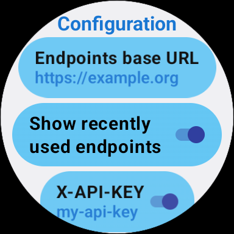

#  HttpClient-WearOS

HttpClient is an app that is currently available for Garmin (on the 
[connect iq store](https://apps.garmin.com/apps/da241207-e929-4cdf-9662-11ab17ffd70d)) and Wear OS 
based smartwatches (as APK [here](https://github.com/cmader/HttpClient-WearOS)). It allows you to 
send HTTP GET requests from your watch to configurable URLs. You can give these requests a custom 
name and organize them in a hierarchy which is browsable on the watch in a convenient way.

The app has been developed with home automation use cases in mind where certain actions can be 
triggered by issuing an HTTP GET request to a local server that controls various appliances. 
However, numerous other use cases are imaginable as well.

## Description

As an input, the app requires an **Endpoints Definition** which is a textual description of all the 
requests that should be selectable on the watch. Here's an example:

```
- all,All
-- off,Office
--- shut_opn,Open shutter,/shut/office/open
--- shut_cls,Close shutter,/shut/office/close
-- liv,Living Room
--- l_on,Lights on,https://192.168.8.1/light/liv/on
-- kit,Kitchen
```

As you can see in the example above, the endpoint definition is structured hierarchically with the 
hierarchy level indicated by `-` characters. This level indicator is then followed by a unique 
identifier. After that, the request's human readably name as it will be shown on the watch display 
is given, and finally the HTTP request URL. All these elements are separated by comma.

The request url can be given both in "relative" format (i.e., providing only a path as shown 
with the office requests) or in absolute format, including protocol and host as it is the case with 
the living room request. If you use "relative" URLs, the app automatically adds a "Base URL" in 
front of the paths (see Section "App Configuration").

## Configuration

HttpClient needs to access the Endpoints Definition from the (local) network. This is done by
providing an **Endpoints base URL** in the app's configuration screen (see Section "App
Configuration"). The app internally appends the path `/endpoints` to the Endpoints base URL. So if
you set your Endpoints base URL to, for instance, `https://example.org`, HttpClient tries to fetch
the Endpoints Definition from `https://example.org/endpoints`. **IMPORTANT**: The endpoints 
definition response must have the `Content-Type` header set to `text/plain`.

When the app is started for the first time, the following screen appears:



Here you can configure the Endpoints base URL that determines where the endpoint definition is
downloaded (see Section "Description"). In addition there is an option to show the 8 recently used
endpoints. If the option is activated,  it will show the entry "Recently Used" as first item on 
the top hierarchy level on the watch display. The config option *X-API-KEY* allows you to define
a value that is sent to the server by using the `X-API-KEY` header for *every* request. 

Pressing the back button of the watch confirms the configuration and brings up the endpoints 
interaction screen which is described in the section below.

## Endpoint Interaction

Getting back to our endpoint definition example above, this is how the first hierarchy level will 
be shown on the watch:


If you select "Office", the display will switch to the second hierarchy level, which is indicated 
on the top of the list:


Tapping on one of the "shutter" entries issues the request.

### Display of Response Text

If the HTTP requests returns a response text with HTTP status `200` and `Content-Type` header set 
to `text/plain`, the text is shown by the app in a separate view. You can see an example with a 
sensor's temperature reading below:


## Installation

To install the app you need to download the `.apk` file from 
[this](https://github.com/cmader/HttpClient-WearOS) repository. After that, the file must be 
transferred to the Wear OS device (smartwatch). There are several guides how to do this, for 
example [here](https://www.makeuseof.com/sideload-apps-wear-os-galaxy-watch/) and 
[here](https://xdaforums.com/t/how-to-install-apps-on-wear-os-all-methods.4510255/). Just use the
method you're most comfortable with.

### Compatibility

The app has been tested with Wear OS 4, API level 33 with round display (1.2") in the emulator and
on a Samsung Galaxy watch 5.

## Changelog

v1.1.0: Add config option for sending X-API-KEY header
v1.0.2: Add optic and haptic feedback on menu item presses. As long as a request is in progress,
the endpoint button is displayed with a darker background color.
v1.0.1: Improve error handling on request failure

## Open Issues and Next Steps

* Improve error handling on endpoint definition parsing
* Optimize performance

If you experience any bugs or issues using the app, please contact me! The software is developed
as a personal leisure time side project with no commercial interest whatsoever. Hence no ads, nag
screens, donate buttons or other annoying stuff.

## Distribution and License
[HttpClient for Wear OS](https://github.com/cmader/HttpClient-WearOS) © 2024 by 
[Christian Mader](https://github.com/cmader) is licensed under 
[CC BY-NC-ND 4.0](https://creativecommons.org/licenses/by-nc-nd/4.0/) 

## Contributors
* [Christian Mader](https://github.com/cmader), Initiator and Developer
